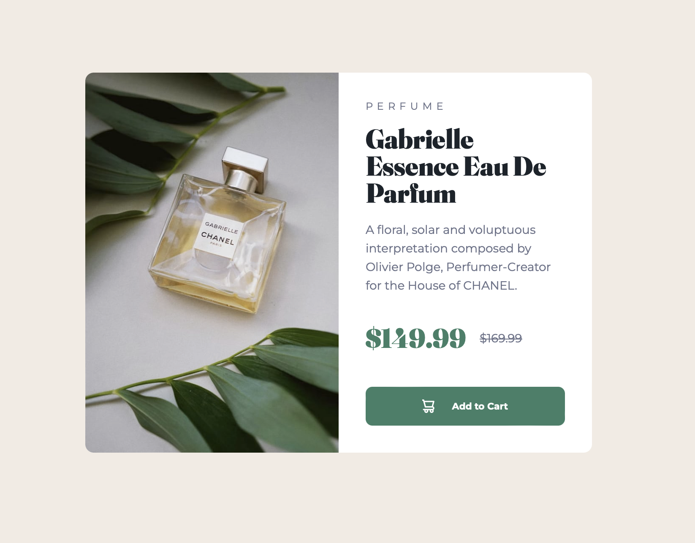

# Frontend Mentor - Product preview card component solution

This is a solution to the [Product preview card component challenge on Frontend Mentor](https://www.frontendmentor.io/challenges/product-preview-card-component-GO7UmttRfa). Frontend Mentor challenges help you improve your coding skills by building realistic projects.

## Table of contents

- [Overview](#overview)
  - [The challenge](#the-challenge)
  - [Screenshot](#screenshot)
  - [Links](#links)
- [My process](#my-process)
  - [Built with](#built-with)
  - [What I learned](#what-i-learned)
  - [Continued development](#continued-development)
  - [Useful resources](#useful-resources)
- [Author](#author)
- [Acknowledgments](#acknowledgments)

**Note: Delete this note and update the table of contents based on what sections you keep.**

## Overview

### The challenge

Users should be able to:

- View the optimal layout depending on their device's screen size
- See hover and focus states for interactive elements

### Screenshot



### Links

- Solution URL: [here](https://github.com/lgwarda/product-preview-card-component.git)
- Live Site URL: [here](https://lgwarda.github.io/product-preview-card-component/)

## My process

### Built with

- Semantic HTML5 markup
- CSS custom properties
- Flexbox
- CSS Grid

### What I learned

1. **Mobile-first CSS Approach**

I started with a mobile-first CSS structure, ensuring the layout and styles were optimized for smaller screens first. This is a best practice that helps
build responsive designs more effectively.

```css
.card {
  display: flex;
  flex-direction: column;
  background-color: var(--white);
  border-radius: 10px;
  overflow: hidden;
  max-width: 343px;
}
```

2. **Responsive Image Handling**

I implemented a responsive image solution, using separate image sources for mobile and desktop. This ensures the appropriate image is displayed based on the viewport size, optimizing for performance and visual quality.

```html
<figure class="product-image-container">
  
  
</figure>
```

```css
.mobile-image {
  display: block;
  width: 100%;
  height: auto;
}

.desktop-image {
  display: none;
}

@media screen and (min-width: 640px) {
  .mobile-image {
    display: none;
  }

  .desktop-image {
    display: block;
    width: 100%;
    height: 100%;
    object-fit: cover;
  }
}
```

3. **Semantic HTML Structure**

You improved the HTML structure by using more semantic elements like figure and figcaption, which better convey the meaning and relationships between
the content.

```html
<figure class="product-image-container">
  <!-- Image elements -->
  <figcaption class="product-category">Perfume</figcaption>
</figure>
```

### Continued development

#### Typography

While I was able to implement the Montserrat and Fraunces fonts effectively, I think there is room for improvement in how I approach typography in future projects. Some areas to focus on:

- Exploring more advanced typographic techniques like modular scale, vertical rhythm, and font pairing
- Learning how to better optimize font loading and rendering for performance
- Experimenting with more creative typographic treatments and layouts

#### Fluid Layouts

The responsive layout adjustments I made worked well, but I'd like to explore more fluid and flexible approaches in the future. This could include:

- Incorporating more relative units like `rem` and `em` instead of `px` for better scalability
- Experimenting with CSS Grid and Flexbox in combination for more complex layouts
- Learning techniques like CSS Calc() and aspect-ratio to create truly responsive and adaptive designs

#### Image Optimization

While I handled the mobile and desktop image switching correctly, there are additional optimizations I could explore:

- Implementing responsive image techniques like `srcset` and `sizes` attributes
- Exploring image formats like WebP and AVIF for better compression and quality
- Using lazy loading and other performance best practices for image-heavy designs

By focusing on these areas in future projects, I can continue to improve my skills in typography, fluid layouts, and image optimization. This will allow me to create more robust, performant, and visually compelling designs.

### Useful resources

- [Example resource 1](https://www.example.com) - This helped me for XYZ reason. I really liked this pattern and will use it going forward.
- [Example resource 2](https://www.example.com) - This is an amazing article which helped me finally understand XYZ. I'd recommend it to anyone still learning this concept.

**Note: Delete this note and replace the list above with resources that helped you during the challenge. These could come in handy for anyone viewing your solution or for yourself when you look back on this project in the future.**

## Author

- Frontend Mentor - [@lgwarda](https://www.frontendmentor.io/profile/lgwarda)

## Acknowledgments

I would like to thank Frontend Mentor for this challenge and everyone who provided feedback. Your support has been invaluable.
